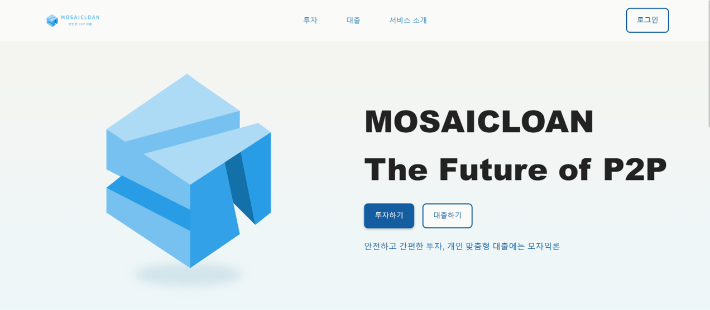
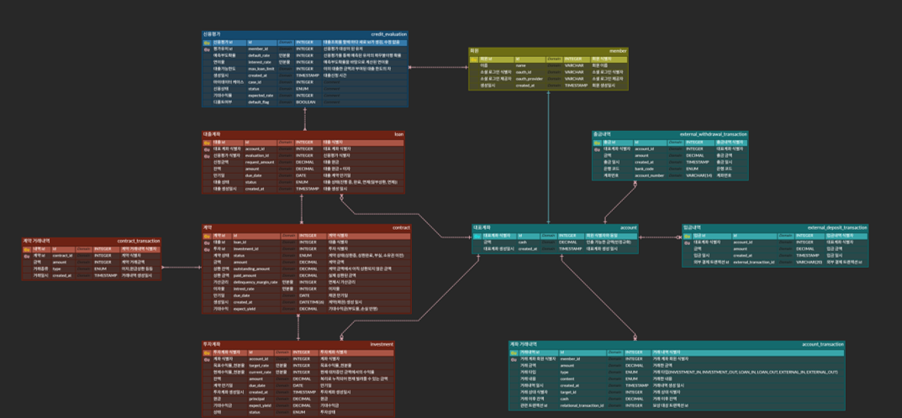
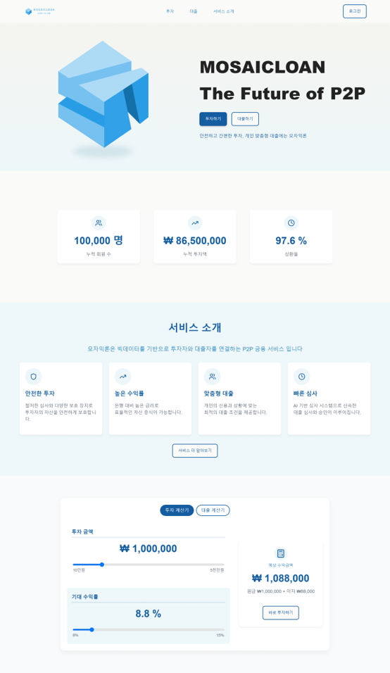
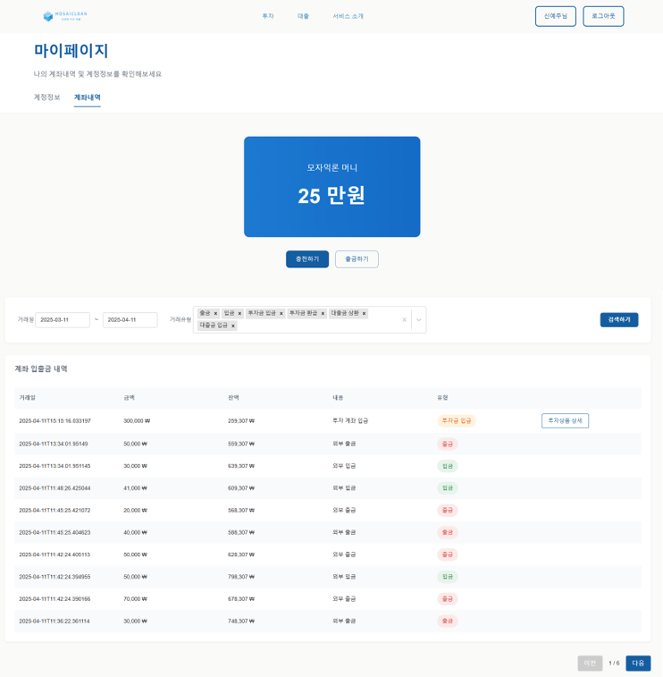
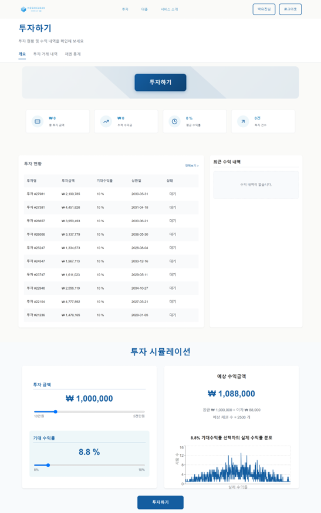
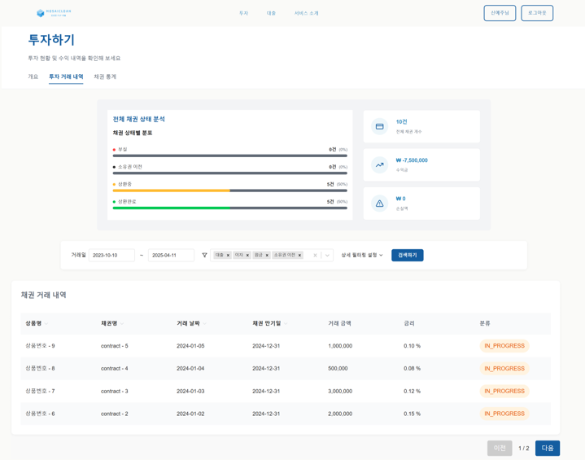
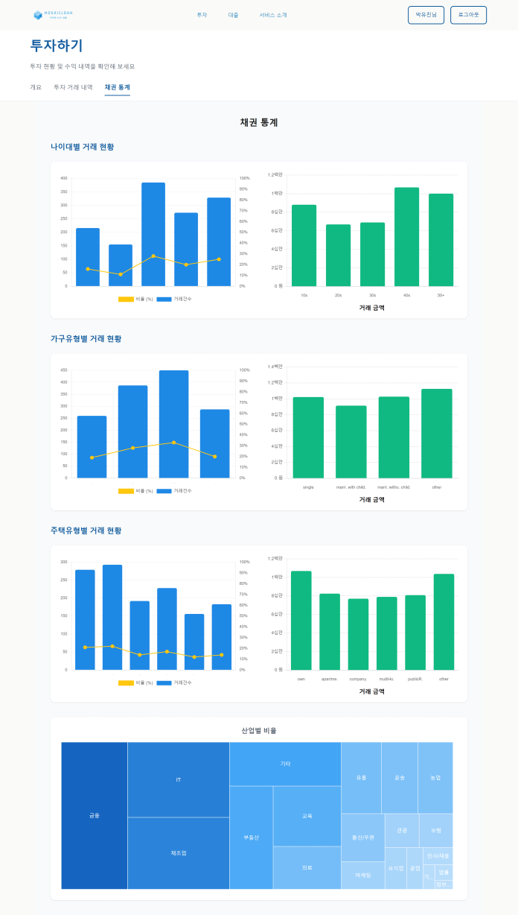
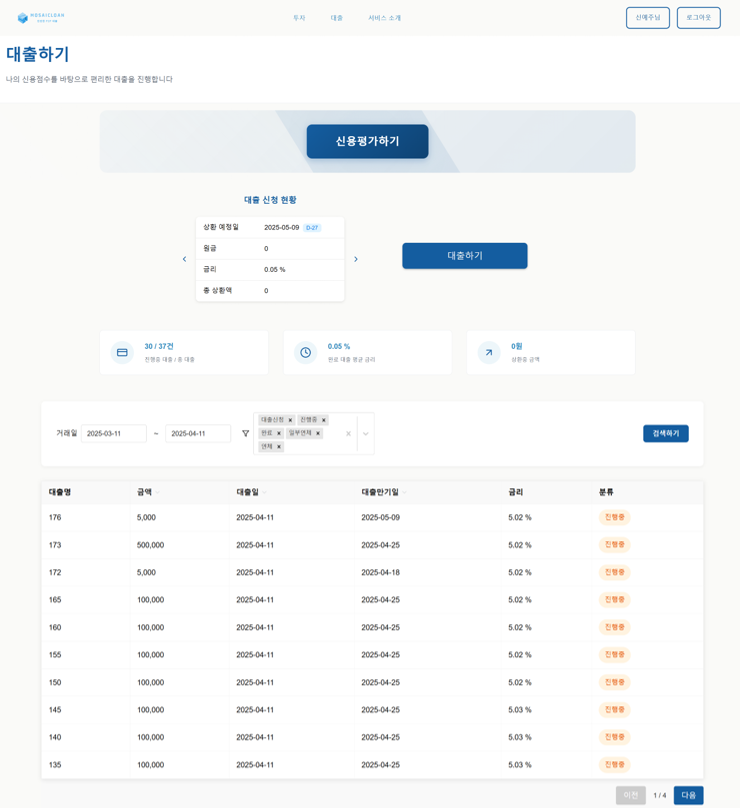

# 모자익론 (P2P 재태크 플랫폼)

> ### 목차
1. [서비스 개요](#1-서비스-개요)
2. [주요 기능](#2-주요-기능)
3. [서비스 흐름](#3-서비스-흐름)
4. [팀 구성 및 역할](#4-팀-구성-및-역할)

## 1. 서비스 개요
### 1-1. 서비스 개요
> **모자익론(MosaicLoan)**은 투자자의 자산을 자동 분산하여 투자 리스크를 낮추고, 차입자에게는 신용 평가 기반의 맞춤형 대출 기회를 제공하는 P2P 금융 투자 및 대출 플랫폼입니다.

모자익론이라는 이름은 하나의 투자금을 마치 모자이크 조각처럼 여러 차입자에게 분산시킨다는 의미를 담고 있습니다.

### 1-2. 문제 정의
- 투자자 입장 
원하는 수익률에 맞는 상품을 직접 찾고 관리해야 하는 부담 
개별 차입자에 대한 신뢰성과 리스크 판단이 어려움

- 차입자 입장 
전통 금융권에서의 신용평가 기준이 높아 대출 접근이 제한됨 
금융 이력이 부족하거나 비정형 데이터를 보유한 사용자에게 불리함

- 시장의 공통 문제 
기존 P2P 플랫폼은 단순 중개에 그치는 경우가 많아, 투자/대출 모두의 만족도를 높이기 어려움 

### 1-3. 기대 효과
1. 투자자 측면
- 안정적인 수익 확보
- 투자 운영에 대한 부담 감소

2. 차입자 측면
- 기존 금융권에서 소외되었던 개인의 금융 접근성 확대
- 신용등급 개선 기회를 제공

## 2. 주요 기능
### 2-1 자동 분산 투자 시스템
- 투자자는 개별 차입자를 선택할 필요 없이 투자 금액과 기대 수익률만 입력
- 시스템이 신용평가와 시장 경제를 기반으로 최적의 차입자에게 투자를 분배함
- 리스크 최소화를 위한 분산투자 적용

### 2-2 차입자 신용평가 시스템
- 차입자의 금융 이력, 상환 기록, 소득 수준 등의 데이터를 기반으로 신용점수 산출
- 빅데이터 모델을 활용한 대출 상환 가능성 예측
- 신용 등급에 따라 대출 한도 및 금리를 차등 적용

## 3. 서비스 흐름
### 3-1. 서비스 흐름

### 3-2. ERD 

### 3-3. 시스템 아키텍쳐

### 3-4. 모델링
#### 경제 분석 모델

- **목표**: 경제 뉴스 데이터를 기반으로 경제 흐름 예측  
- **주요 기법**:
  - **Topic Modeling**  
    - 크롤링된 데이터에는 '경제'와 무관한 기사도 포함되어 있음  
    - LDA 등 주제 모델링 기법을 통해 **유의미한 경제 기사만 필터링**
  - **감정 분석 (Sentiment Analysis)**  
    - `KLUE-BERT` 등 LLM 모델을 활용해 뉴스 기사의 **긍/부정 감정 판단**

---

#### 신용평가 모델

- **목표**: 고객의 대출 이력 기반 **채무 불이행 가능성 예측**
- **데이터**: 고객의 결제 이력, 신용국 정보, 고용 정보 등 
 
<**🛠 전처리 및 모델링 전략**>

| 초점 영역                       | 분석 방법             |
|------------------------------|---------------------|
| 결제 행동 및 이력              | 행동 점수화 + 분류 모델 |
| 신용국 데이터 + 과거 대출 이력  | 분류 모델             |
| 인구통계 및 고용 정보          | 군집화 분석           |
| 시간 기반 변화 및 집계 특성     | 시계열 + 분류 모델     |

### 3-5. 화면 구성
 |  |  |  |
|:-----------------------------------------------:|:--------------------------------------:|:--------------------------------------:|
|메인페이지                       | 마이페이지 (계좌 거래내역)                           | 투자하기 (개요 및 시뮬레이션)           |

|  |  |  |
|:--------------------------------------------------------:|:-----------------------------------------------:|:------------------------------------:|
| 투자하기 (거래 내역)                                      | 투자하기 (채권 통계)                             | 대출하기                             |

  

## 4. 팀 구성 및 역할

| Contributors | Role                       | Position         |
| ------------ | -------------------------- | ------------------------------------------------------------------------------------------------------------------------------------------------------------------------------------------------------------------------------------------------------------------------------------------------------------------------------------------------------------------------------------------------------------------------------------------------------------------------------------------------------------------------------------------------------------------------------------------------------------------------------------------------------------------------------------------------------------------------------------------------------------------------------------------------------------------------------------------------------------------------------------------------------------------------------------------------------------------------- |
| 박유진      | 팀장 & Frontend       | - **예시 소제목 1:** 예시 내용1   - **예시 소제목 2:** 예시 내용2  
| 강재현      | Backend       | - **예시 소제목 1:** 예시 내용1   - **예시 소제목 2:** 예시 내용2  
| 오지석      | Backend       | - **예시 소제목 1:** 예시 내용1   - **예시 소제목 2:** 예시 내용2  
| 윤덕건      | Backend       | - **예시 소제목 1:** 예시 내용1   - **예시 소제목 2:** 예시 내용2  
| 신예주      | AI Modeling & Frontend       | - **예시 소제목 1:** 예시 내용1   - **예시 소제목 2:** 예시 내용2  
| 이연규      | AI Modeling & Frontend       | - **예시 소제목 1:** 예시 내용1   - **예시 소제목 2:** 예시 내용2  
